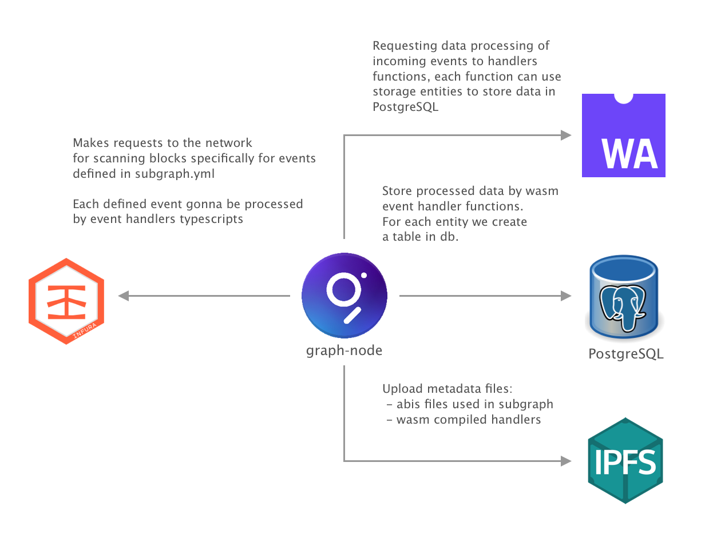
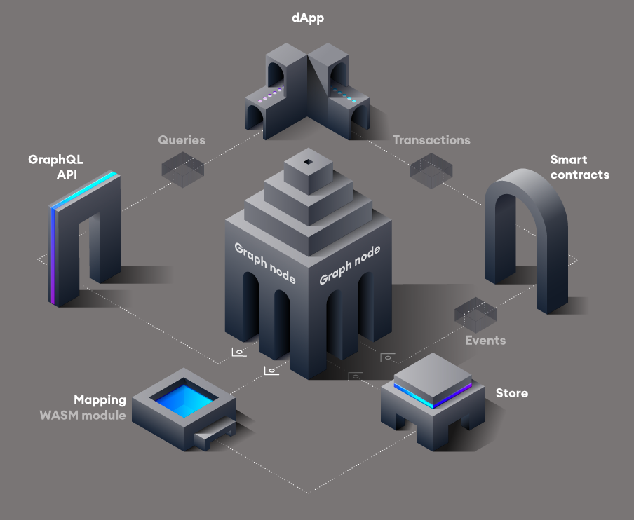

# Phuture Subgraph

To generate entity structures from the graphql scheme we need to execute `npm run codegen` for each subgraph
stored in `subgraphs` folder.

```bash
npm run codegen

// To pretify codegenrated and the rest code written on typescript.
npm run lint:fix
```

Then we have to build code-generated entities for the storage and graphql, with the defined typescripts which
are handling the events from the blockchain.

```bash
npm run build
```

## Subgraph declaration

Each of the subgraph must declare such list of the scripts in `package.json`

```json
{
  "scripts": {
    "precodegen": "rimraf src/types src/mappings/chainlink/aggregators/*.ts && node config/index.js",
    "codegen": "graph codegen --output-dir src/types/",
    "build": "graph build",
    "create:local": "graph create phuture/${name_of_your_subgraph} --node http://0.0.0.0:8020",
    "deploy:local": "graph deploy phuture/${name_of_your_subgraph} --ipfs http://0.0.0.0:5001 --node http://0.0.0.0:8020"
  }
}
```
Short explanation of the specified list of scripts:
- `precodegen` drops the caches previously code generated entities, `node config/index.js` execute templating for this files like: `{subgraph}/subgraph.yaml`, `{subgraph}/consts.ts`, etc.
- `codegen` executes code-generation process, simply saying everything what is defined int the `{subgraph}/schema.graphql` 
- `build` executes typescript compilation to wasm bytecode which going to be running on the graph hosted server
- `create:local` create subgraph entity in the self-hosted node, `${name_of_your_subgraph}` must be uniq name of your subgraph
- `deploy:local` executes compilation of typescripts and deploying the metadata information to local ipfs node, and deploying wasm binaries to the local graph node

## Local development

For local development we have prepared `docker-compose.dev.yml` and `docker-compose.yml` files, where we define list of the services needed for graph-node instance.
Short list of the graph relation between services:

```bash
// run services with connection to infura api
INFURA_KEY={your_infura_key} docker-compose -f docker-compose.dev.yml up -d

// run services with connection to local private node in ganache
docker-compose -f docker-compose.yml up -d
```

Short overview of the services relation.



## Subgraph overview



## Example with processing `vToken` events

### Definition of storable entities 

If we want to store aggregated data in database to be able to query them by grapql after, we need to define such
entities in `schema.graphql` file:

```graphql
type vToken @entity {
  "Address (hash)"
  id: ID!
  asset: Asset!
  tokenType: String!
  deposited: BigInt
}
```

When new entities are ready we need to generate typescript data structures for them, by running `npm run codegen` in the subgraph folder.
All code-generated entities we store in `{subgraph}/types/schema.ts` file, for this specific Entity, data must be following:

```typescript
export class vToken extends Entity {
  constructor(id: string) {
    super();
    this.set("id", Value.fromString(id));

    this.set("asset", Value.fromString(""));
    this.set("tokenType", Value.fromString(""));
  }

  save(): void {
    let id = this.get("id");
    assert(id != null, "Cannot save vToken entity without an ID");
    if (id) {
      assert(
        id.kind == ValueKind.STRING,
        "Cannot save vToken entity with non-string ID. " +
          'Considering using .toHex() to convert the "id" to a string.'
      );
      store.set("vToken", id.toString(), this);
    }
  }

  static load(id: string): vToken | null {
    return changetype<vToken | null>(store.get("vToken", id));
  }

  get id(): string {
    let value = this.get("id");
    return value!.toString();
  }

  set id(value: string) {
    this.set("id", Value.fromString(value));
  }

  get asset(): string {
    let value = this.get("asset");
    return value!.toString();
  }

  set asset(value: string) {
    this.set("asset", Value.fromString(value));
  }

  get tokenType(): string {
    let value = this.get("tokenType");
    return value!.toString();
  }

  set tokenType(value: string) {
    this.set("tokenType", Value.fromString(value));
  }

  get deposited(): BigInt | null {
    let value = this.get("deposited");
    if (!value || value.kind == ValueKind.NULL) {
      return null;
    } else {
      return value.toBigInt();
    }
  }

  set deposited(value: BigInt | null) {
    if (!value) {
      this.unset("deposited");
    } else {
      this.set("deposited", Value.fromBigInt(<BigInt>value));
    }
  }
}
```

In such typescript definition `id` field always become a primary key and used for loading/saving. 
All entities are storable in postgres, so when we define new entity with this fields set, in postgres must be created
table with similar structure. 

Here is example of table structure created in postgres for the `vToken` entity:

```postgresql
create table sgd3.v_token
(
    id text not null,
    asset text not null,
    token_type bytea not null,
    vid bigserial
    constraint v_token_pkey
    primary key,
    block_range int4range not null,
    constraint v_token_id_block_range_excl
    exclude using gist (id with =, block_range with &&)
);
```

### Events processing

To track events from the blockchain we should define these events in the subgraph configuration file, where we 
specify abi files and events structure, also we need to set the address of smart-contract and the block start 
number to start scanning the blockchain.

Example of `bugraph.template.yaml`:

```yaml
  - kind: ethereum/contract
    name: vTokenFactory
    network: {{network}}
    source:
      abi: vTokenFactory
      address: '{{VTokenFactory}}'
      startBlock: {{VTokenFactoryBlockNumber}}
    mapping:
      kind: ethereum/events
      apiVersion: 0.0.5
      language: wasm/assemblyscript
      entities:
        - vToken
      abis:
        - name: vTokenFactory
          file: ../abis/Phuture/vTokenFactory.json
        - name: ERC20
          file: ../abis/ERC20/ERC20.json
        - name: ERC20SymbolBytes
          file: ../abis/ERC20/ERC20SymbolBytes.json
        - name: ERC20NameBytes
          file: ../abis/ERC20/ERC20NameBytes.json
      eventHandlers:
        - event: VTokenCreated(address,address,bytes32)
          handler: handleVTokenCreated
      file: ./src/mappings/phuture/vTokenFactory.ts
```

Here we define all smart-contract which we are listening, and the mapping between event and event handler, in such case
we are listening `VTokenCreated` events, and execute `handleVTokenCreated` handler function with the event data. To
show how we store this entity lets have an example of the code of this handler:

```typescript
export function loadOrCreateVToken(address: Address): vToken {
    let id = address.toHexString();
    let vt = vToken.load(id);
    if (!vt) {
        vt = new vToken(id);
        vt.deposited = BigInt.zero();
    }

    return vt as vToken;
}

export function handleVTokenCreated(event: VTokenCreated): void {
  if (event.params.vToken.equals(Address.zero())) return;

  let vt = loadOrCreateVToken(event.params.vToken);
  vt.asset = event.params.asset.toHexString();
  
  if (event.params.vTokenType == STATIC_TYPE_HASH) {
    vt.tokenType = STATIC_TYPE;
  } else if (event.params.vTokenType == DYNAMIC_TYPE_HASH) {
    vt.tokenType = DYNAMIC_TYPE;
  }
  
  vt.save();
}

```

So here we receive the data from event, do some business logic relevant to this entity and making a save request in
to database, so after we will be available to make a queries to this data.
